# XKKit

[](https://travis-ci.org/ALLen、LAS/XKKit)
[](http://cocoapods.org/pods/XKKit)
[](http://cocoapods.org/pods/XKKit)
[](http://cocoapods.org/pods/XKKit)

## Example

To run the example project, clone the repo, and run `pod install` from the Example directory first.

## Method
 
 消息处理中心 : XKMsgCenter 

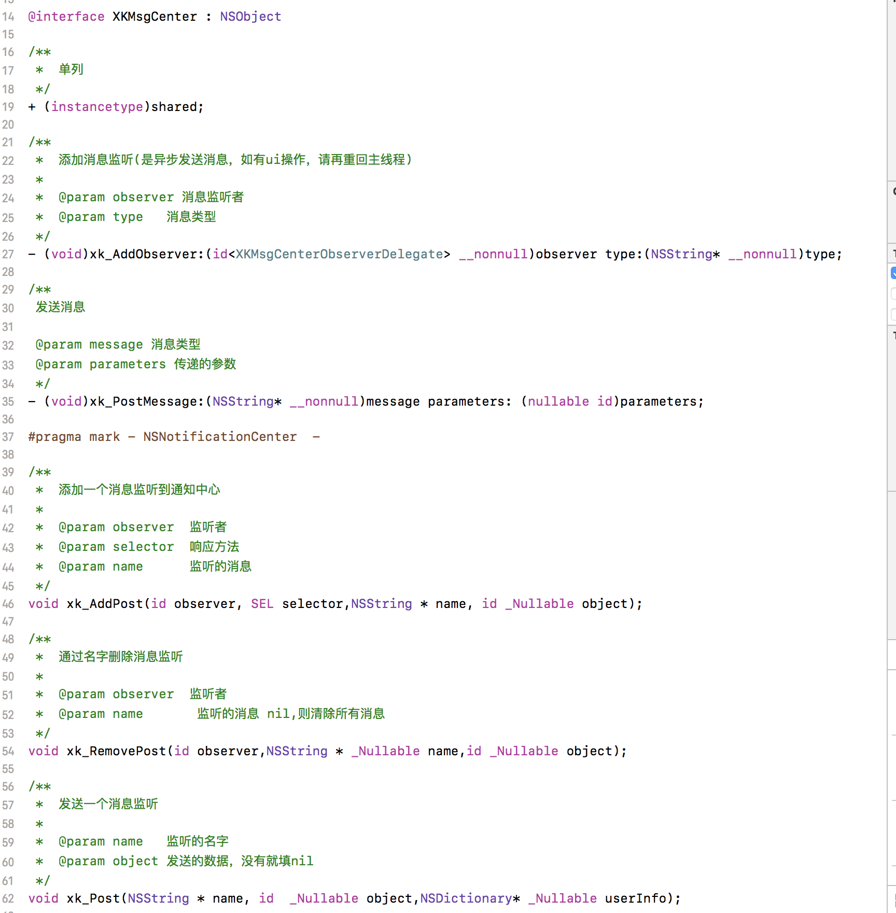

常见的GCD 方法封装:

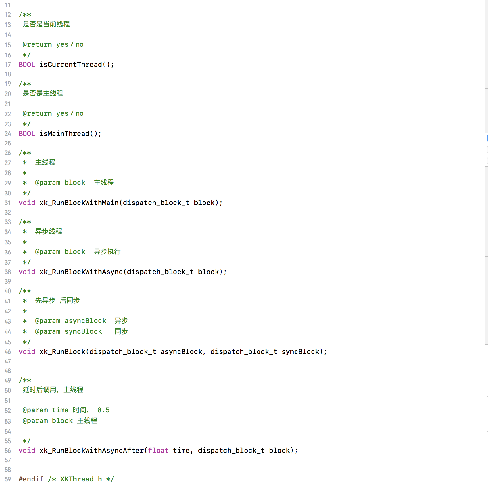


## Installation

XKKit is available through [CocoaPods](http://cocoapods.org). To install
it, simply add the following line to your Podfile:

```ruby
pod 'XKKit'
```

### Xcode制作framework流程

```
在日程项目开发中可以使用用framework打包的静态库能够包含图片、xib等资源。
而用.a打包的静态库，我们需要再建立一个Bundle文件来包含图片、xib等资源 
``` 

1. 先创建-个framework项目

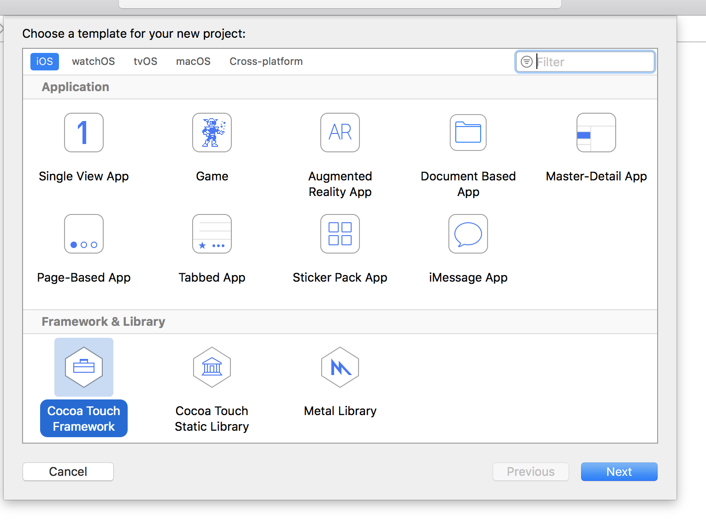

2. 将链接时生成的执行文件类型设置成`static`类型／动态库时则选择`dynamic`类型

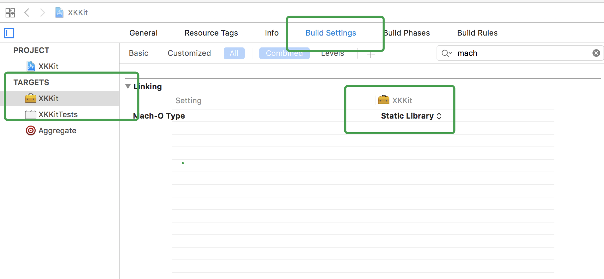

3. 设置framework支持多种架构配置(Architecture的配置)

```
 真机（armv7＝3gs-4s，armv7s＝5-5c， arm64＝5s-6plus）
 
 模拟器（i386=3gs-5，x86_64=5s-6plus）
```
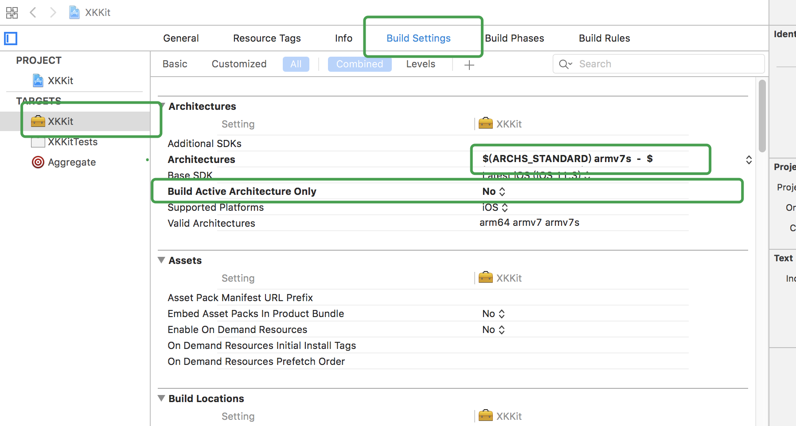

4. 将xib、图像资源包含到framework中，将需要暴露的.h文件放在`Public`中，需要编译的.m文件放在`Compile Sources`

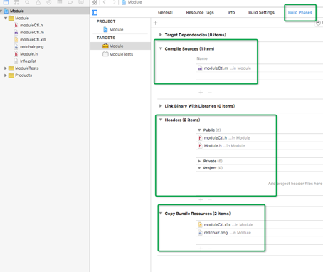

5. 在建立framework时自动生成的头文件中加入要`暴露的头文件.h`，否则会报Warning

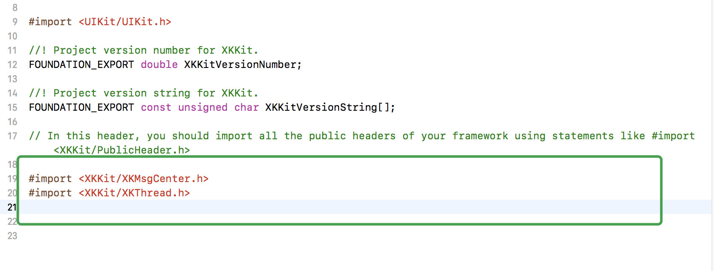

6. 选中真机／模拟器，Command＋B 编译，生成只支持真机／模拟器的静态库

7. 对.framework 右键 Show In Finder 找到对应的静态库

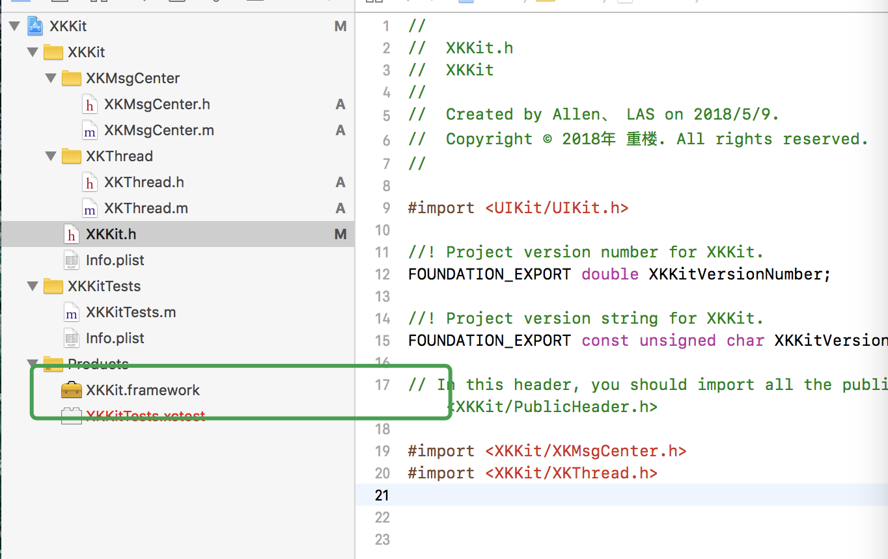

8. 对真机和模拟器生成的 `.framework ` 进行验证( Terminal-终端 验证)

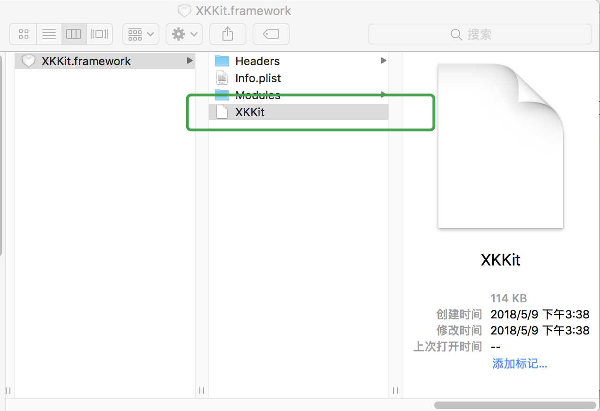

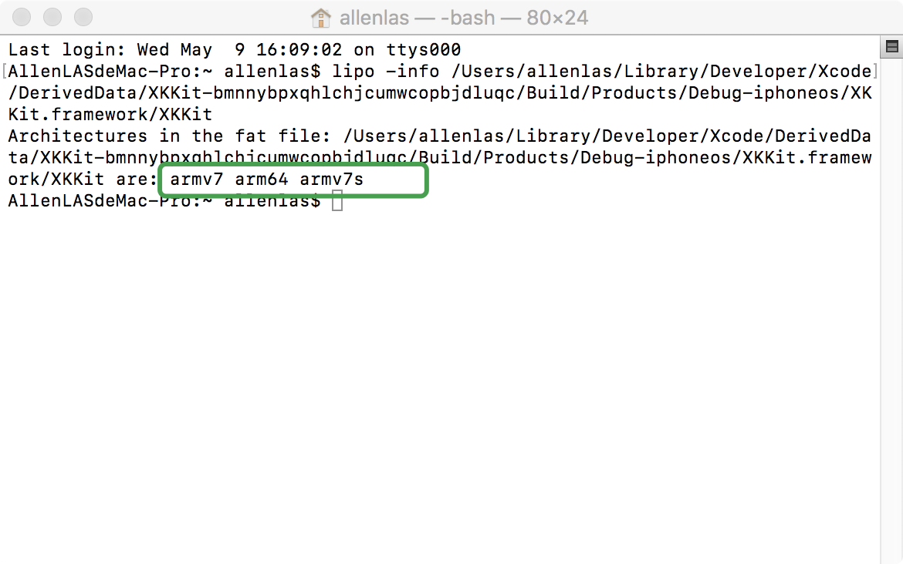

### 使用Aggregate制作通用的framework

```
	制作通用库主要利用到Aggregate，其主要有两个特性 
	1、能给一次编译多个target
	2、能够在编译的时候运行自定义脚本（target也可以）

```

1. 先创建-个Aggregate 文件

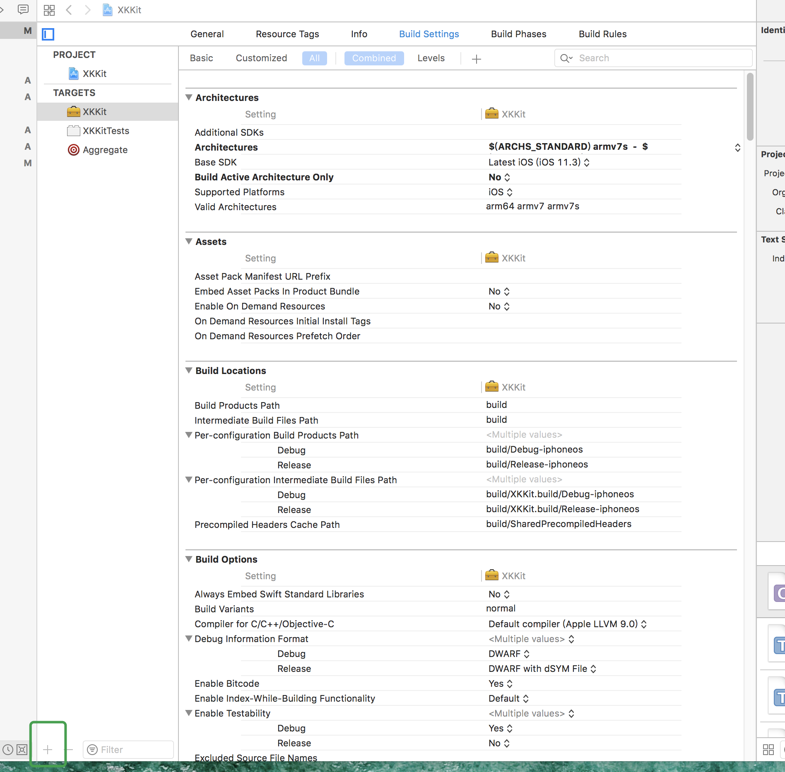

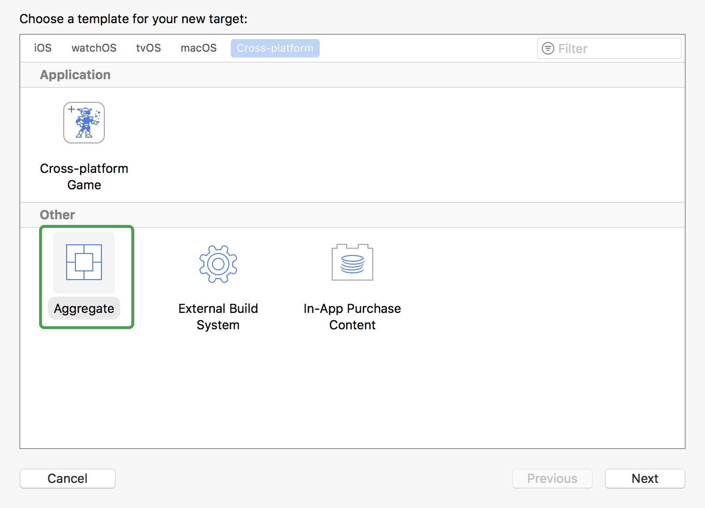

2. 编写自定义shell脚本

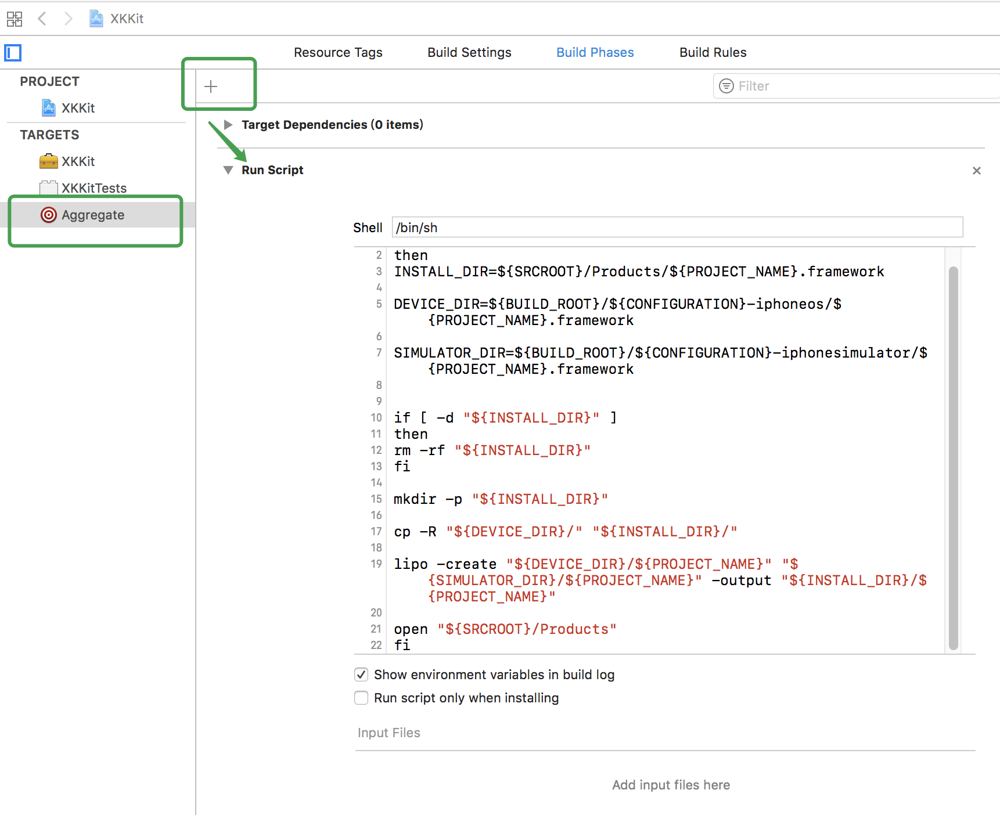

#####脚本命令:

```
if [ "${ACTION}" = "build" ]
then
INSTALL_DIR=${SRCROOT}/Products/${PROJECT_NAME}.framework

DEVICE_DIR=${BUILD_ROOT}/${CONFIGURATION}-iphoneos/${PROJECT_NAME}.framework

SIMULATOR_DIR=${BUILD_ROOT}/${CONFIGURATION}-iphonesimulator/${PROJECT_NAME}.framework


if [ -d "${INSTALL_DIR}" ]
then
rm -rf "${INSTALL_DIR}"
fi

mkdir -p "${INSTALL_DIR}"

cp -R "${DEVICE_DIR}/" "${INSTALL_DIR}/"

lipo -create "${DEVICE_DIR}/${PROJECT_NAME}" "${SIMULATOR_DIR}/${PROJECT_NAME}" -output "${INSTALL_DIR}/${PROJECT_NAME}"

open "${SRCROOT}/Products"
fi

```
2. 运行Aggregate,验证framework 支持类型
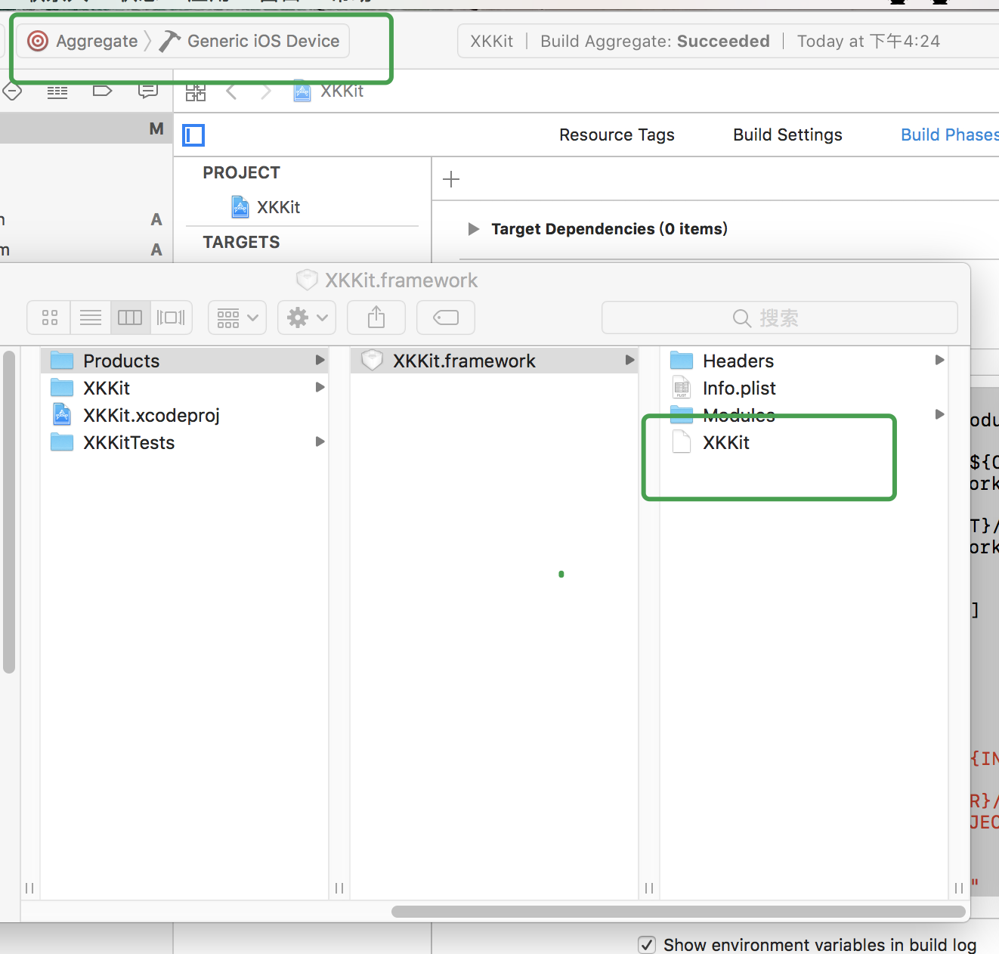

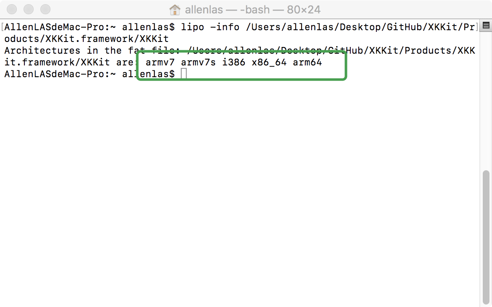


### 使用framework静态库

* 新建一个工程，将framework静态库拖入工程中，并选中copy item选项

* 在`Build Phrase`中配置如下，Copy Bundle Resources会将资源保存到Main Bundle中，`可以使用NSBundle接口获取资源`

	
* 在头文件中添加需要的库的头文件

	
    
    
    ## Author
    
    ALLen、LAS, 1696186412@qq.com
    
    ## License
    
    XKKit is available under the MIT license. See the LICENSE file for more info.

